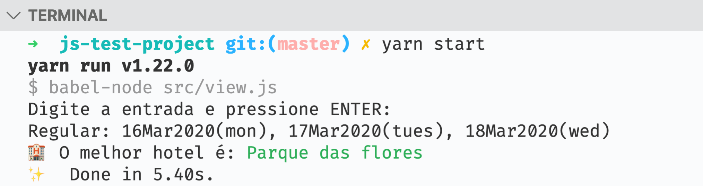

Nearly empty javascript project with a failing test!
===

To install the required modules:

```bash
$ yarn install
```

To run the application:

```bash
$ yarn start
$ Digite a entrada e pressione ENTER:
$ Regular: 16Mar2020(mon), 17Mar2020(tues), 18Mar2020(wed)
```

It will log the name of better hotel in your console:



To collect test coverage:

```
$ yarn test
```
